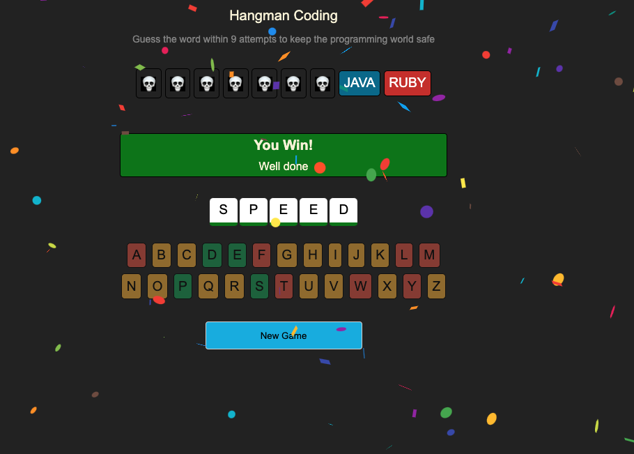

# 🕹️ React Hangman Game

A fully interactive, letter-based Hangman game built with React, using modern optimization techniques like `React.memo`, `useMemo`, and `useCallback`. The game features randomized word generation, a shrinking list of "hanging candidates", and a celebratory confetti effect upon winning!



---

## ✨ Features

- 🔤 Letter guessing interface with smart UI feedback
- 💀 "Hangman candidates" visually marked as inactive on wrong guesses
- 🎉 Confetti win animation (lazy-loaded for performance)
- 📉 Limited number of chances based on number of candidates
- ♻️ Play-again button with full state reset
- ⚡ Optimized with memoization to minimize re-renders

---

## 🧠 Optimizations Used

### ✅ `React.memo`
Used on `Letters` and `Candidates` components to prevent unnecessary re-renders when props haven't changed.

### ✅ `useMemo`
Memoizes:
- The alphabet array
- Derived `Set`s (`guessedSet`, `wordSet`) to avoid recalculating on each render

### ✅ `useCallback`
Memoizes the `removeHangmanChoice` and `handleGuess` functions so they remain stable between renders.

### ✅ `lazy` + `Suspense`
Lazy-loads the `Confetti` component so it's only pulled in after a win — reducing initial bundle size.

---

## 🧩 Component Overview

| Component     | Responsibility                                      |
|---------------|------------------------------------------------------|
| `App`         | Root game logic and state handling                   |
| `Letters`     | Renders clickable alphabet buttons                   |
| `Candidates`  | Displays current "hanging" word choices              |
| `Header`      | Simple branding or title (customizable)              |

---

## 🛠️ Tech Stack

- React 18+
- `react-confetti` for win animation
- `react-use` for window size detection
- `random-words` for generating fresh word challenges

---

## 📦 Installation

```bash
npm install
npm start
